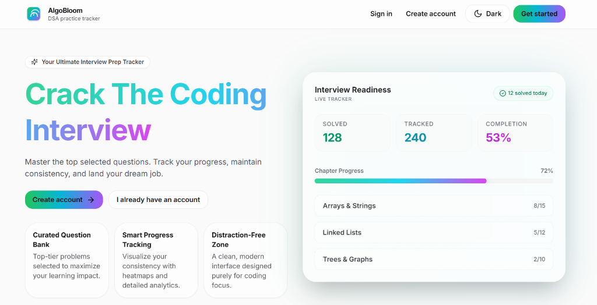
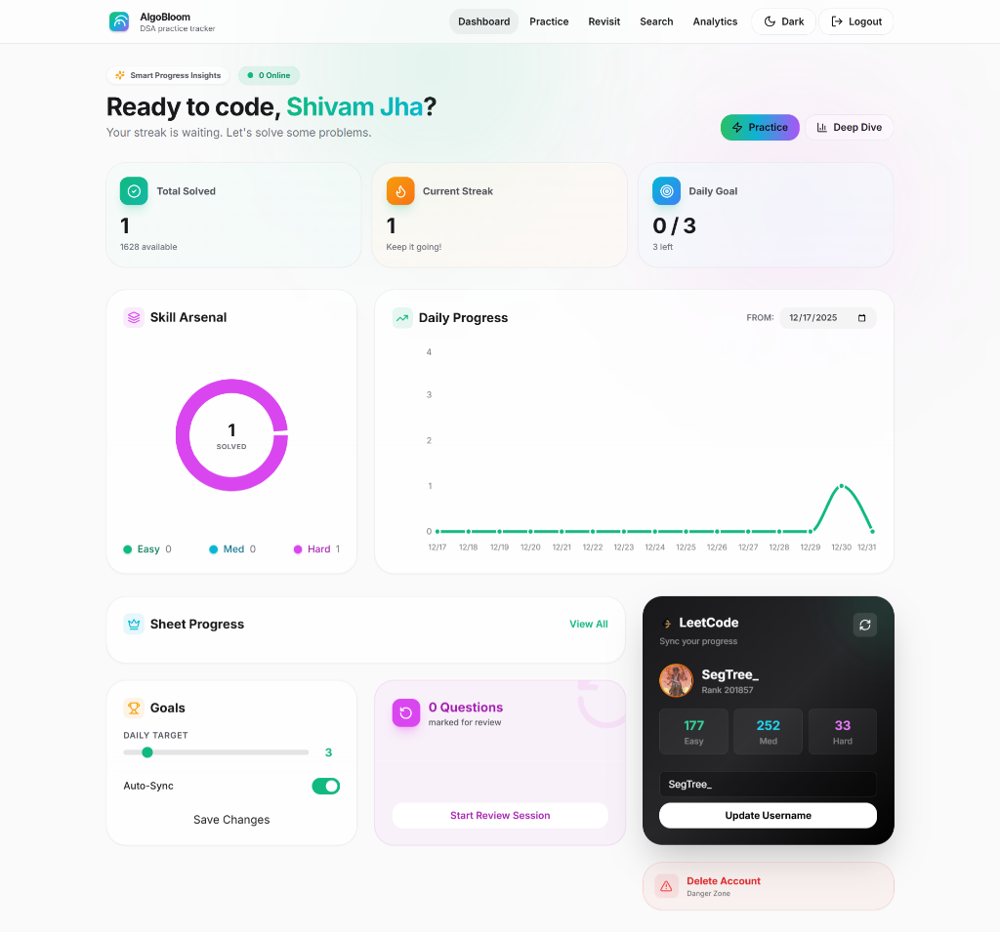
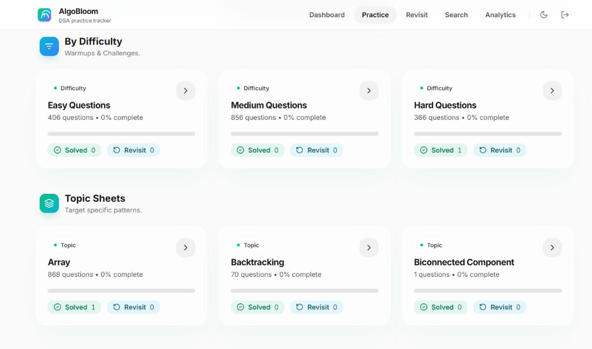
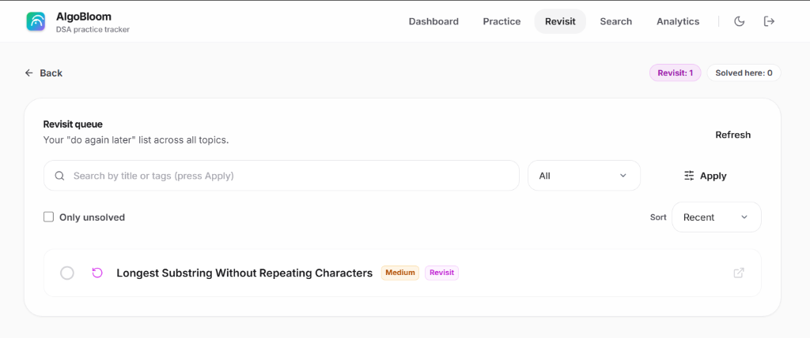

# AlgoBloom - Your Ultimate DSA Practice Tracker 🚀



**AlgoBloom** is a modern, feature-rich DSA tracker designed to help you organize your preparation, track progress, and crack your coding interviews. Built with the **MERN** stack (MongoDB, Express, React, Node.js), it offers a premium, distraction-free environment for serious aspirants.

## ✨ Key Features

### 📊 Comprehensive Dashboard
Visualize your progress with heatmaps, streak tracking, and difficulty breakdowns. Stay motivated with daily goals and real-time statistics.


### 🎯 Curated Topic Sheets
Import your favorite DSA sheets (like Cracking the Coding Interview, Love Babbar, Striver, etc.) via Excel. Browse questions by topic to maintain structured learning.


### 📝 Smart Question Lists
Filter, search, and sort questions with ease. Mark questions as **Solved** or add them to your **Revisit** queue for spaced repetition. High-performance filters help you find exactly what you need.


### 🔄 Review & Retention
Never lose track of tricky problems. The dedicated **Revisit** section ensures you review crucial patterns before your interviews.


---

## 🛠️ Tech Stack
-   **Frontend:** React (Vite), TailwindCSS, Framer Motion, Recharts
-   **Backend:** Node.js, Express, MongoDB (Mongoose)
-   **Authentication:** Custom JWT (JSON Web Tokens) - No external auth providers like Clerk required.
-   **Deployment:** Optimized for Vercel (Frontend + Serverless Backend in one repo).

---

## 🚀 Getting Started

### 1) Prerequisites
-   **Node.js 18+**
-   **MongoDB Atlas** connection string (recommended)

### 2) Backend Setup
```bash
cd backend
cp .env.example .env
# Edit .env and set MONGO_URI + JWT_SECRET
npm install
npm run dev
```
Backend runs on `http://localhost:5000`.

### 3) Frontend Setup
```bash
cd frontend
cp .env.example .env
# Set VITE_API_URL=http://localhost:5000
npm install
npm run dev
```
Frontend runs on `http://localhost:5173`.

### 4) Importing Questions (Excel Seed)
AlgoBloom allows you to seed your database from an Excel workbook.
1.  Place your workbook in the `workbook/` directory (e.g., `workbook/Crack The Coding Interview.xlsx`).
2.  In `backend/.env`, set:
    ```env
    SEED_EXCEL_PATH=../workbook/Crack The Coding Interview.xlsx
    ```
3.  Run the seed command:
    ```bash
    cd backend
    npm run seed
    ```
    *(To clear old data: `CLEAR_DB=true npm run seed`)*

---

## ☁️ Deployment (Vercel)

This repository is configured for easy deployment on Vercel as a monorepo.

1.  **Import** this repository into Vercel.
2.  Vercel will detect `vercel.json` and deploy both the frontend (static) and backend (serverless functions).
3.  **Environment Variables** (Vercel Project Settings):
    -   `MONGO_URI`: Your MongoDB connection string.
    -   `JWT_SECRET`: A secure random string.
    -   `CLIENT_URL`: Your production frontend URL (e.g., `https://your-project.vercel.app`).
4.  **Deploy**!

---
Made with ❤️ for interview success.
